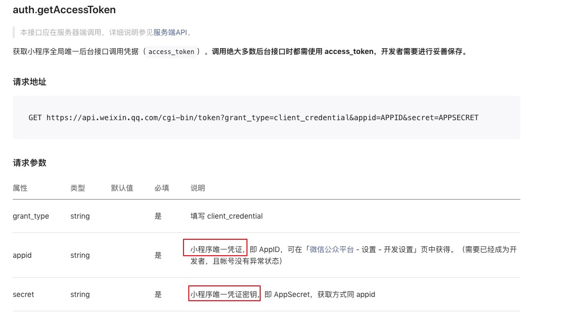
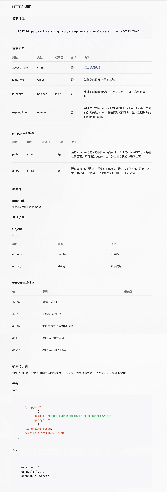
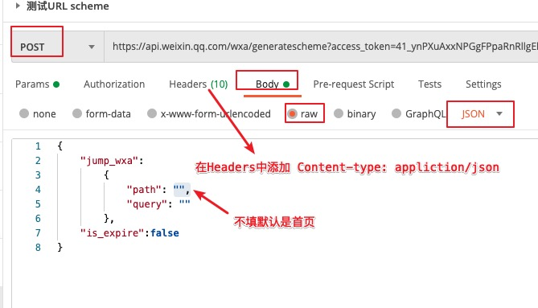

### 流程

1、获取access_token，[文档](https://developers.weixin.qq.com/miniprogram/dev/api-backend/open-api/access-token/auth.getAccessToken.html)

```
GET https://api.weixin.qq.com/cgi-bin/token?grant_type=client_credential&appid=APPID&secret=APPSECRET
```




2、生成 URL scheme，[文档](https://developers.weixin.qq.com/miniprogram/dev/api-backend/open-api/url-scheme/urlscheme.generate.html)

```
POST https://api.weixin.qq.com/wxa/generatescheme?access_token=ACCESS_TOKEN
```







3、通过 URL scheme  可以直接打开微信跳转到小程序，但由于URL scheme 只在ios支持比较好，所以最终的过程为

+ 从短信到网页
+ 从网页打开URL scheme 跳转到小程序

即先要有个网页，然后发送短信，短信内容包含地址

4、拷贝修改当前项目静态页面资源 `index.html` 和 `qrcode.min.js`，其中`qrcode.min.js` 是用来支持如果是在pc端打开这个 `html`，将会渲染一个二维码指向当前URL，提供给用户用手机扫码访问，可不需要，则需要在 `index.html` 中删掉对应代码。在 `index.html` 搜索 replace 替换文案或参数

4.1、或拷贝官方示例，[地址](https://github.com/TCloudBase/WXSEVER-SMS)，拷贝里面的 `index.html` 和 `web2weapp.js`，修改`web2weapp.js`中的对应参数。

5、部署静态页面 `index.html`

+ 部署在微信小程序云开发静态网站上，可以在微信外部和微信内部打开
+ 如果你上传至其他静态托管或者是服务器，你仍然可以使用外部浏览器拉起小程序的能力，但会丧失在微信浏览器用开放标签拉起小程序的功能，也不会享受到云开发短信发送跳转链接的能力。

### 无代码方案

参考文档：[link](https://developers.weixin.qq.com/community/develop/doc/0006ec98c84e10cfba8b20fbc56009?highLine=%25E4%25BA%2591%25E5%25BC%2580%25E5%258F%2591%25E7%259F%25AD%25E4%25BF%25A1%25E8%25B7%25B3%25E5%25B0%258F%25E7%25A8%258B%25E5%25BA%258F)

前置工作步骤介绍：

+ 开通小程序云开发并创建环境

+ 开通内容管理CMS，需要开通按量计费

+ 成功开通，会提供一个独有的内容管理平台地址。

创建群发任务步骤介绍：

1、创建一个内容管理新项目

2、运营工具-营销活动，配置开通营销工具，提供小程序名称、小程序AppId、小程序原始账号ID

3、点击营销活动，创建一个新的营销活动，决定跳转到哪个小程序。
  + 活动名
  + 活动是否开启
  + 开始时间，结束时间
  + 跳转中间页面海报，即跳转过程中的加载图，可以不上传，会有默认样式。
  + 小程序跳转路径，已发布上线的小程序中页面路径
  + 小程序跳转参数，附带路径的传入参

4、运营工具-群发短信，创建短信群发任务
  + 短信内容
  + 手机号码包，可以是多个，用逗号分隔
  + 选择上面创建的活动
  + 确认发送
  + 发送之后，可以查看每一条的发送结果。

5、可以在内容管理平台上，创建各种角色。比如短信发送者角色，使其有且只有权限进行第4步，选择对应的营销活动，编辑短信内容，发送。

### 总结

#### 自定义开发：部署在自己的服务器

+ 链接是自己服务器的链接。
+ 链接在微信端点击没有打开小程序的能力，只支持在微信外部（短信、QQ、浏览器、任意支持外部链接点击打开浏览器的地方）打开小程序。
+ 需要有短信发送平台支持，才能完成短信打开小程序功能。

可以使用微信开放标签，但是需要再**向后台进行单独的鉴权**。并对手机系统和微信版本均有要求，微信版本要求为：7.0.12及以上。 系统版本要求为：iOS 10.3及以上、Android 5.0及以上。而且跳转到h5页面之后**需要用户手动点击打开**。 [参考文档](./微信开放标签.md)

#### 自定义开发：部署在小程序云开发静态网站

+ 按量收费（流量）
+ 必须托管小程序本身的云开发环境里面
+ 支持从微信外部和微信内部通过链接打开小程序。
+ 需要有短信发送平台支持，才能完成短信打开小程序功能。官方推荐【腾讯云国内短信】

#### 无代码方案

借助小程序云开发的内容管理平台

优点：

+ 方便营销活动管理，无需任何代码。
+ 内容管理平台本身支持短信群发
  
缺点：

+ 按量收费
+ 一个小程序对应一个内容管理平台
+ 短信发送存在诸多限制：
  + 时间：8:00-22:00
  + 只能给每人一天最多发送10条，1分钟内最多发送1条
  + 目前体验是1000条，如果需要增加，需要联系官方。

#### 短信方面

通过腾讯云国内短信服务进行短信发送，文档`https://cloud.tencent.com/document/product/382/37745`
+ 按条收费，没有总量限制。
+ 创建短信签名，配置发送过程繁琐。